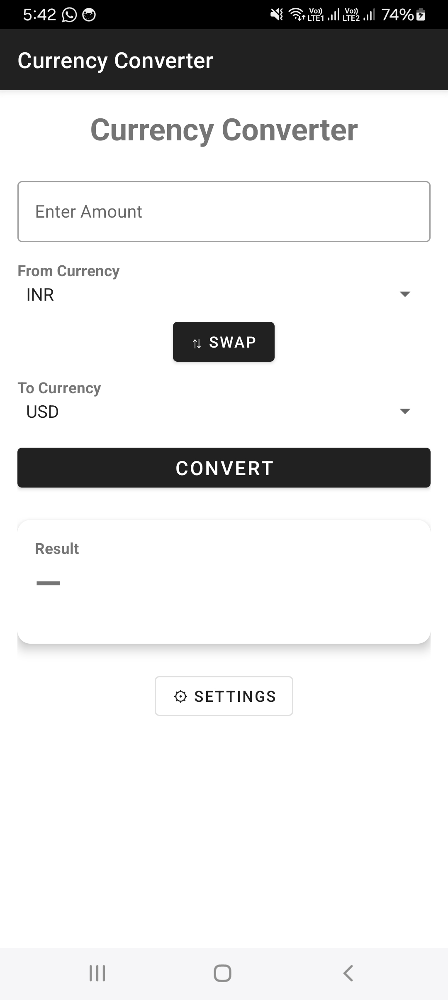
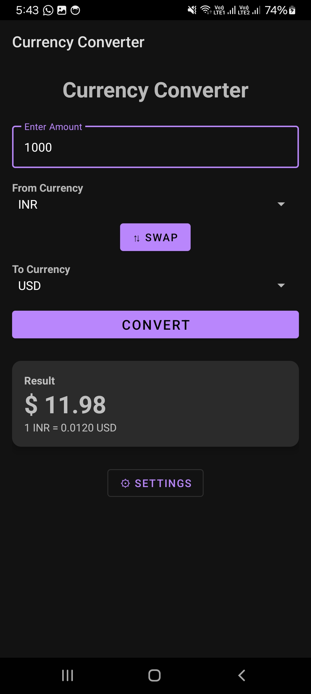
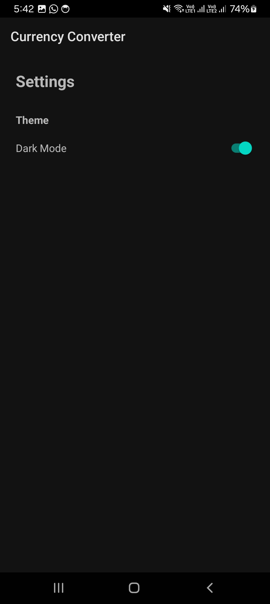
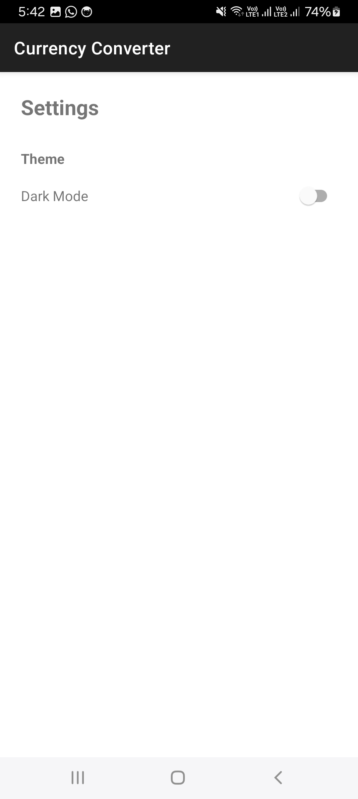
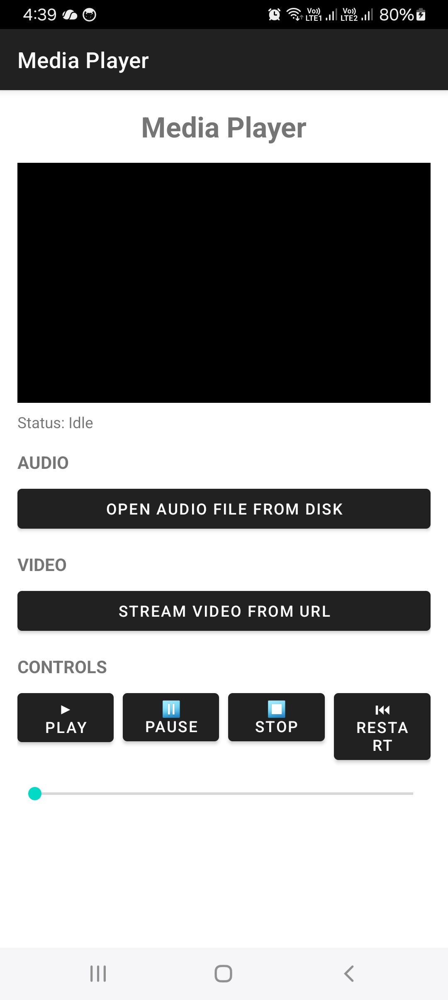
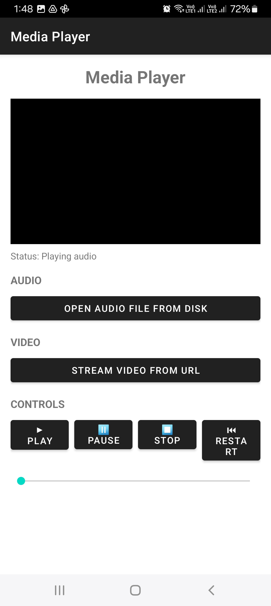
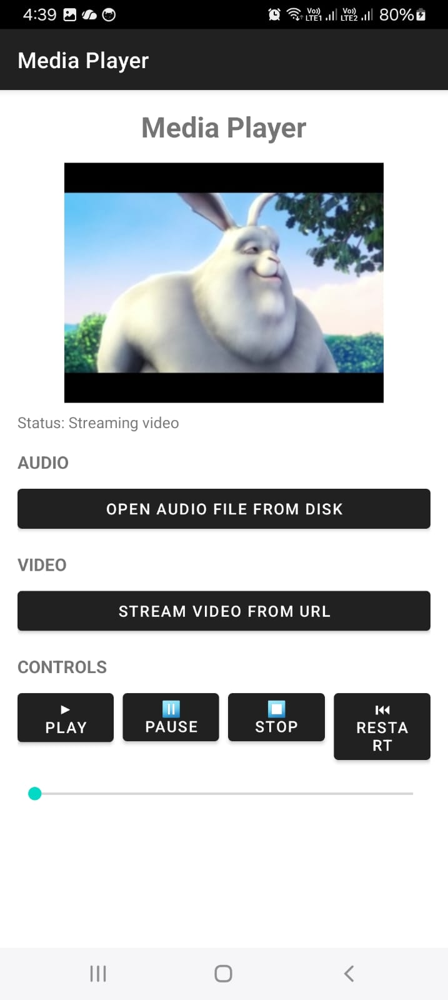
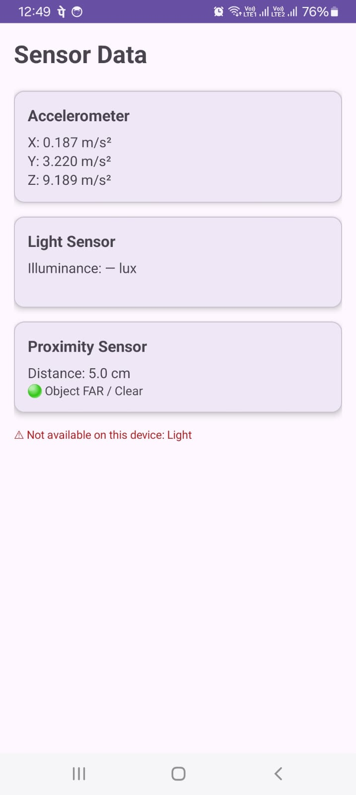

# Mobile Application Development - Graded Assignment

> **Course:** Mobile Application Development  
> **Section:** CSE8  
> **Name:** Sanjana  
> **Language:** Java  
> **IDE:** Android Studio 
---

## Repository Structure
```
MobileDevAssignment/
├── Q1_CurrencyConverter/
├── Q2_MediaPlayer/
├── Q3_SensorApp/
└── Q4_PhotoGallery/
```

---

## Q1 - Currency Converter App

### Description
A simple Currency Converter Android application that converts between **INR, USD, JPY and EUR** currencies. Also includes a **Settings page** to toggle between **Light and Dark theme**.

### Features
- Convert between INR, USD, JPY, EUR
- Swap button to swap currencies
- Real-time exchange rate display
- Light / Dark theme toggle in Settings
- Clean Material Design UI

### Screenshots
| Home Screen | Result | Dark Mode | Settings |
|-------------|--------|-----------|----------|
|  |  |  |  |

### Tech Used
- Java
- ViewBinding
- SharedPreferences
- AppCompatDelegate (DayNight Theme)
- Material Components

---

## Q2 - Media Player App

### Description
An Android Media Player app that can **play audio files from device storage** and **stream video from a URL**. Complete playback controls included.

### Features
- Open and play audio file from device disk
- Stream video from URL
- Play, Pause, Stop, Restart buttons
- SeekBar for scrubbing
- Status display

### Screenshots
| Home Screen | Audio Playing | Video Streaming |
|-------------|---------------|-----------------|
|  |  |   |

### Tech Used
- Java
- MediaPlayer
- VideoView
- MediaController
- ActivityResultContracts
- ViewBinding

---

## Q3 - Sensor Data App 

### Description
An Android app that reads and displays **live sensor data** from the device's built-in sensors — Accelerometer, Light, and Proximity.

### Features
- Live Accelerometer data (X, Y, Z axis)
- Live Light sensor data (lux value + description)
- Live Proximity sensor data (NEAR / FAR)
- Handles missing sensors gracefully
- Auto updates in real time

### Screenshots
| Sensor Screen |
|---------------|
|  | 

### Tech Used
- Java
- SensorManager
- SensorEventListener
- ViewBinding
- Material CardView

---

## Q4 - Photo Gallery App

### Description
A complete Photo Gallery Android app that allows users to **take photos using camera**, **browse folders**, **view images in a grid**, and **view/delete image details**.

### Features
- Take photos using device camera
- Save photos to Pictures/PhotoGallery folder
- Browse any folder on device
- View all images in 3-column grid layout
- View image details (name, path, size, date)
- Delete image with confirmation dialog
- Returns to gallery after delete

### 📸 Screenshots
| Home | Camera | Gallery Grid | Image Details | Delete Dialog |
|------|--------|--------------|---------------|---------------|
|  |  |  |  |  |

### Tech Used
- Java
- FileProvider
- DocumentsContract
- RecyclerView + GridLayoutManager
- Glide Image Library
- ActivityResultContracts
- AlertDialog
- ViewBinding

---

## How to Run

1. Clone this repository:
```bash
git clone https://github.com/Sanjana2622/MobileDevAssignment.git
```
2. Open any project folder in **Android Studio**
3. Click **Sync Now** when prompted
4. Click **▶ Run** button
5. App will launch on emulator or real device

---

## Requirements

- Android Studio (latest)
- Minimum SDK: API 24 (Android 7.0)
- Target SDK: API 36
- Java 11

---

## Notes

- Q3 Sensor app works best on a **real device**
- Q4 Camera feature requires a **real device**
- Q2 Video streaming requires **internet connection**

---

## 📧 Contact

**Name:** Sanjana  
**GitHub:** [Sanjana2622](https://github.com/Sanjana2622)
```

---


